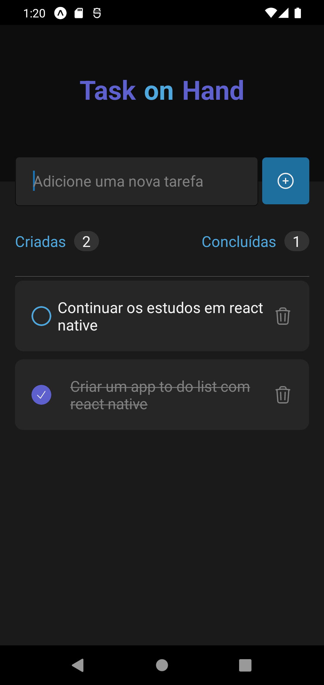

# Task On Hand
<div>
    
    
    
    
    
    
</div>

## Sobre
O **Task On Hand** é uma aplicação desenvolvida em React Native para gerenciamento de tarefas. A aplicação permite criar, visualizar, concluir e excluir tarefas, com uma interface moderna e intuitiva.

## Requisitos e Como Rodar a Aplicação Localmente

### Pré-requisitos
- **Node.js** versão 16 ou superior
- Um dispositivo físico ou emulador configurado

### Passos para Configuração

1. Clone o repositório:
    ```bash
    git clone https://github.com/guilhermevnbraga/TaskOnHand.git
    ```

2. Navegue até o diretório do projeto:
    ```bash
    cd TaskOnHand
    ```

3. Instale as dependências do projeto:
    ```bash
    npm install
    ```

4. Inicie o servidor Expo:
    ```bash
    npx expo start
    ```

5. Escaneie o QR Code no terminal com o aplicativo **Expo Go** no seu dispositivo físico, ou execute o projeto em um emulador configurado.

## Estrutura do Projeto

A estrutura do projeto é organizada da seguinte forma:

- **app/**: Contém o código principal da aplicação.
  - `index.tsx`: Componente principal que renderiza a aplicação.
- **assets/**: Contém fontes e imagens usadas na aplicação.
  - **styles/**: Contém estilos globais e específicos.
  - **images/**: Contém a imagem de preview do app.
- **components/**: Contém os componentes reutilizáveis.
  - `Task.tsx`: Componente responsável pela exibição e interação com tarefas.

## Preview do app

<div align="center">
    
</div>